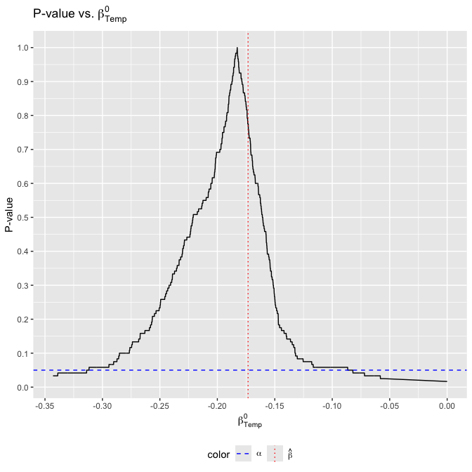
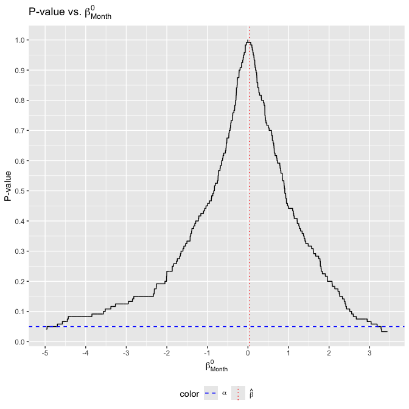

<!-- README.md is generated from README.Rmd. Please edit that file -->

# exactt 

<!-- badges: start -->

[](https://CRAN.R-project.org/package=exactt)
[](https://github.com/ian-xu-economics/exactt/actions/workflows/R-CMD-check.yaml)
[](https://github.com/ian-xu-economics/exactt/actions/workflows/pkgdown.yaml)
[](https://github.com/ian-xu-economics/exactt/actions/workflows/test-coverage.yaml)
[](https://codecov.io/gh/ian-xu-economics/exactt)
[](https://choosealicense.com/licenses/gpl-2.0/)
<!-- badges: end -->

## Introduction

The `exactt` package computes a $(1-\alpha)\%$ confidence interval for
coefficients in a linear model using the method described in Pouliot
(2023).

## Installation

The `exactt` package is hosted on GitHub at
<https://github.com/ian-xu-economics/exactt/>. It can be installed using
the `remotes::install_github()` function:

``` r
# install.packages("remotes")
remotes::install_github("ian-xu-economics/exactt")
```

## Attribution

To cite the `exactt` package in publications, use the `citation()`
function, which provides both the text version and the BibTeX entry for
referencing:

``` r
citation("exactt")
```

## Using `exactt`

After installing `exactt`, we can attach the package to our session
using the base `library()` function:

``` r
library("exactt")
#> Package 'exactt' | Version 1.1.3
```

## Example Usage

To compute the $(1-\alpha)\%$ confidence interval, use the `exactt()`
function. Here’s an example using daily air quality measurements in New
York found in `datasets::airquality`. We’ll investigate the relationship
between temperature (degrees F) and month (1–12) on wind (mph).

``` r
summary(datasets::airquality[c("Wind", "Temp", "Month")])
#>       Wind             Temp           Month      
#>  Min.   : 1.700   Min.   :56.00   Min.   :5.000  
#>  1st Qu.: 7.400   1st Qu.:72.00   1st Qu.:6.000  
#>  Median : 9.700   Median :79.00   Median :7.000  
#>  Mean   : 9.958   Mean   :77.88   Mean   :6.993  
#>  3rd Qu.:11.500   3rd Qu.:85.00   3rd Qu.:8.000  
#>  Max.   :20.700   Max.   :97.00   Max.   :9.000
```

Suppose our model is
$$Wind_i = \beta_0 + \beta_{Temp} \times Temp_i + \beta_{Month} \times Month_i + \varepsilon_i.$$
We can create a $(1-\alpha)\%$ confidence interval by plugging in
standard formula notation into `exactt()`. If we don’t specify any
additional parameters, then by default:

- The number of blocks used equals 5 (`nBlocks = 5`).
- The confidence interval is constructed for all variables
  (`variables = NULL`).
- The number of permutations is equal to
  (`nPerms = factorial(nBlocks)`).
- The level of significance equals 0.05 (`alpha = 0.05`).
- The test statistics are studentized (`studentize = TRUE`).
- The ordering of the data is not permuted (`permutation = NULL`).
- The ordering of the data is not optimized (`optimize = FALSE`).

``` r
exactt1 <- exactt(Wind ~ Temp + Month,
                  data = datasets::airquality)
exactt1
#> 
#> Call:
#> exactt(model = Wind ~ Temp + Month, data = datasets::airquality)
#> 
#> 
#> Summary:
#>        Estimate  Pr(>|t|)   2.5% W  97.5% W     2.5%    97.5%
#> Temp   -0.17320   0.01667  -0.3137  -0.0821  -0.3137  -0.0821
#> Month   0.04382   0.99170  -4.9520   3.2810  -4.9520   3.2810
```

## Visualization of Results

If **tidyverse** and **latex2exp** are installed, you can visualize the
results by plotting the p-value against $\beta^0$ using the
`exacttPlot()` function:

``` r
exacttPlot(exactt1)
#> [[1]]
```



    #> 
    #> [[2]]



## Focusing on Specific Variables

To focus on specific coefficients, set the `variables` parameter. The
number entered corresponds to the index of the regressors in the model
(note that the intercept is never counted). For example. set
`variables = 1` for `Temp`, and set `variables = 2` for `Month`.

``` r
exactt2 <- exactt(Wind ~ Temp + Month,
                  data = datasets::airquality,
                  variables = 1)

exactt2
#> 
#> Call:
#> exactt(model = Wind ~ Temp + Month, data = datasets::airquality, 
#>     variables = 1)
#> 
#> 
#> Summary:
#>       Estimate  Pr(>|t|)   2.5% W  97.5% W     2.5%    97.5%
#> Temp   -0.1732   0.01667  -0.3137  -0.0821  -0.3137  -0.0821
```

This creates a 95% confidence interval for `Temp` only. It is equivalent
to the case where `variables = NULL` (all variables are of interest)
because these confidence intervals are marginally valid.

## Model Flexibility

The `exactt()` function is designed to allow easy modification of your
model to fit various analytical needs. For instance, you can treat a
variable as categorical, include polynomial terms, or apply other
transformations directly within the model formula. This flexibility
helps tailor the analysis to specific research questions without needing
pre-transformed data. To illustrate, consider treating `Month` as a
categorical variable to explore its discrete impact on wind speed in a
dataset of daily air quality measurements:

``` r
exactt4 <- exactt(Wind ~ Temp + as.factor(Month),
                  data = datasets::airquality)

exactt4
#> 
#> Call:
#> exactt(model = Wind ~ Temp + as.factor(Month), data = datasets::airquality)
#> 
#> 
#> Summary:
#>                    Estimate  Pr(>|t|)   2.5% W  97.5% W     2.5%    97.5%
#> Temp                -0.1953   0.01667  -0.3112  -0.0851  -0.3112  -0.0851
#> as.factor(Month)6    1.2900   0.02500     -Inf  -4.3270     -Inf  -4.3270
#> as.factor(Month)7    0.9035   0.75830     -Inf      Inf     -Inf      Inf
#> as.factor(Month)8    0.7677   0.41670     -Inf      Inf     -Inf      Inf
#> as.factor(Month)9    0.7740   0.60830     -Inf      Inf     -Inf      Inf
```

The confidence intervals for each category of Month is not informative
due to suboptimal data ordering, which can diminish the statistical
power of the test. This issue can be addressed by optimizing the data
ordering.

## Optimizing Data Ordering

The confidence intervals produced by the `exactt()` function can change
with the ordering of the data. Certain data orderings can enhance
statistical power, particularly when the sample size is small and the
number of blocks is large. The impact of optimization is even more
pronounced when dealing with categorical variables, where appropriate
ordering can substantially increase the test’s power.

The `exactt()` function utilizes a genetic algorithm (provided by the
`GA::ga()` function) to optimize data ordering. This approach
systematically explores various data arrangements to find the one that
maximizes statistical power on average.

## Enabling Optimization

To activate the optimization feature, set `optimize = TRUE`.
Additionally, `exactt()` allows for the specification of various
parameters of the `GA::ga()` function to tailor the optimization
process. For instance, you can limit the number of iterations with
`maxiter` or specify the seed with `seed` for reproducibility:

``` r
exactt5 <- exactt(Wind ~ Temp + as.factor(Month),
                  data = datasets::airquality,
                  optimize = TRUE,
                  parallel = TRUE,
                  maxiter = 5,
                  seed = 2024)

exactt5

#> 
#> Call:
#> exactt(model = Wind ~ Temp + as.factor(Month), data = datasets::airquality, 
#>     optimize = TRUE, parallel = TRUE, maxiter = 5, seed = 2024)
#> 
#> 
#> Summary:
#>                    Estimate  Pr(>|t|)   2.5% W  97.5% W     2.5%    97.5%
#> Temp                -0.1953  0.008333  -0.2673  -0.1127  -0.2673  -0.1127
#> as.factor(Month)6    1.2900  0.375000  -1.2300   2.7040  -1.2300   2.7040
#> as.factor(Month)7    0.9035  0.533300  -1.4200   2.4800  -1.4200   2.4800
#> as.factor(Month)8    0.7677  0.850000  -3.6100   2.1600  -3.6100   2.1600
#> as.factor(Month)9    0.7740  0.408300  -2.3220   3.9110  -2.3220   3.9110
```

Note that by optimizing the data ordering, `exactt()` is now able to
construct informative $(1-\alpha) \%$ confidence intervals for each
category of `Month`. Furthermore, the detailed results of the
optimization process, including the genetic algorithm’s configurations
and outcomes for each variable, are stored in the `exactt5$gaResults`.
For instance, to review a summary of the genetic algorithm’s performance
for the `Temp` variable, use:

``` r
exactt5$gaResults$Temp@summary

#>           max     mean       q3   median       q1      min
#> [1,] 3373.156 2466.905 2756.414 2491.108 2149.217 1628.742
#> [2,] 3379.420 2557.049 2804.535 2564.529 2331.299 1548.839
#> [3,] 3379.420 2550.141 2816.223 2561.671 2278.764 1730.608
#> [4,] 3379.420 2555.116 2761.960 2605.983 2245.362 1538.921
#> [5,] 3379.420 2574.320 2779.467 2574.736 2277.046 1701.787
```

### Note on Optimization Effects

While optimization generally improves statistical power, it is essential
to remember that it increases the average power and may not universally
reduce the confidence interval’s width in every instance.
